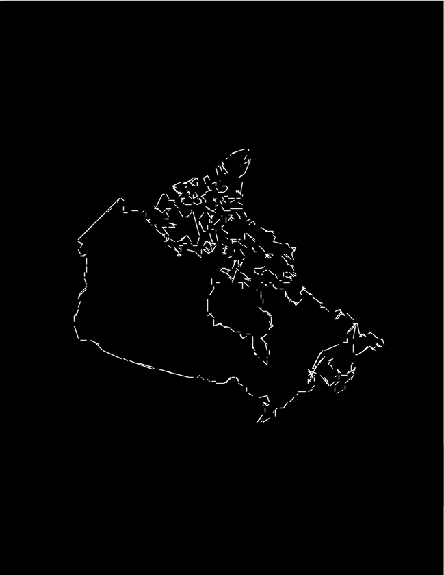

# Pen Plotter Project

A CSI4103 Project, University of Ottawa, Winter 2022.

A two-degree-of-freedom robot shaped like a forearm. Any given picture can be drawn on paper using a pen by tracing the result of an edge detection algorithm.

## Showcase

### Image Processing Steps

1. Gray Scale

2. Gaussian Blur

3. Canny Edge Detection

4. Hough Line Transform

5. Spacial Partitioning for Optimization

6. Optimization Result (Tool Path)

### Result Sample

### Hardware Setup

## Team Members

- Alexandre Pineau

- Hongyi Lin

- Jingyi Jiang

- Rodger Retanal

- Zitai Peng

## File Hierarchy

### HardwareControl

#### Description

- Code to control the actual hardware servos

#### Language

- Python

#### Package Used

- [gpiozero](https://pypi.org/project/gpiozero/)

- [pigpio](https://pypi.org/project/pigpio/)

#### Installation

- Run `pip install -r requirements.txt`

#### Usage

- Run `python3 HardwareControl`

### ImageProcessing

#### Description

- Image Processing Program that converts input image to list of lines

#### Language

- Python

#### Package Used

- [opencv-python](https://pypi.org/project/opencv-python/)

	- [numpy](https://pypi.org/project/numpy/) (dependency)

#### Installation

- Run `pip install -r requirements.txt`

#### Usage

- Run `python3 ImageProcessing`

### InverseKinematics

#### Description

- Converts output from ImageProcessing to angles instead of points

#### Language

- Python

#### Usage

- Example usage: `python __main__.py -la 5 -lb 5 -s example-input.csv --debug`

### InverseKinematicsDemo

#### Description

- A demo program of the inverse kinematics equations that are going to be used in the project.

- Also useful to find out the length and other parameters of the arm.

#### Language

- Processing (Java)

#### Usage

- Run it using Processing IDE

### Models

#### Description

- The 3D models used to design and print the physical arm

#### File Types

- `f3z`: Autodesk Fusion 360 Archive Files

- `stl`: Standard Triangle Language

#### Usage

- Use Autodesk Fusion 360 to open the `f3z` type files to modify CAD steps

- Use Any 3d model viewer to view `stl` type files, use any 3d printer slicer to slice the model and convert it to G code

## License

MIT License
